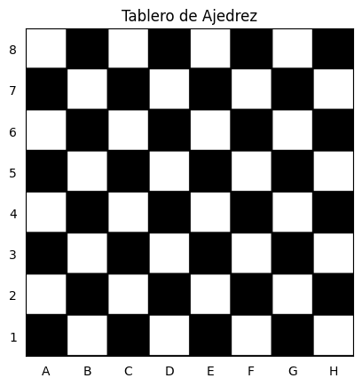
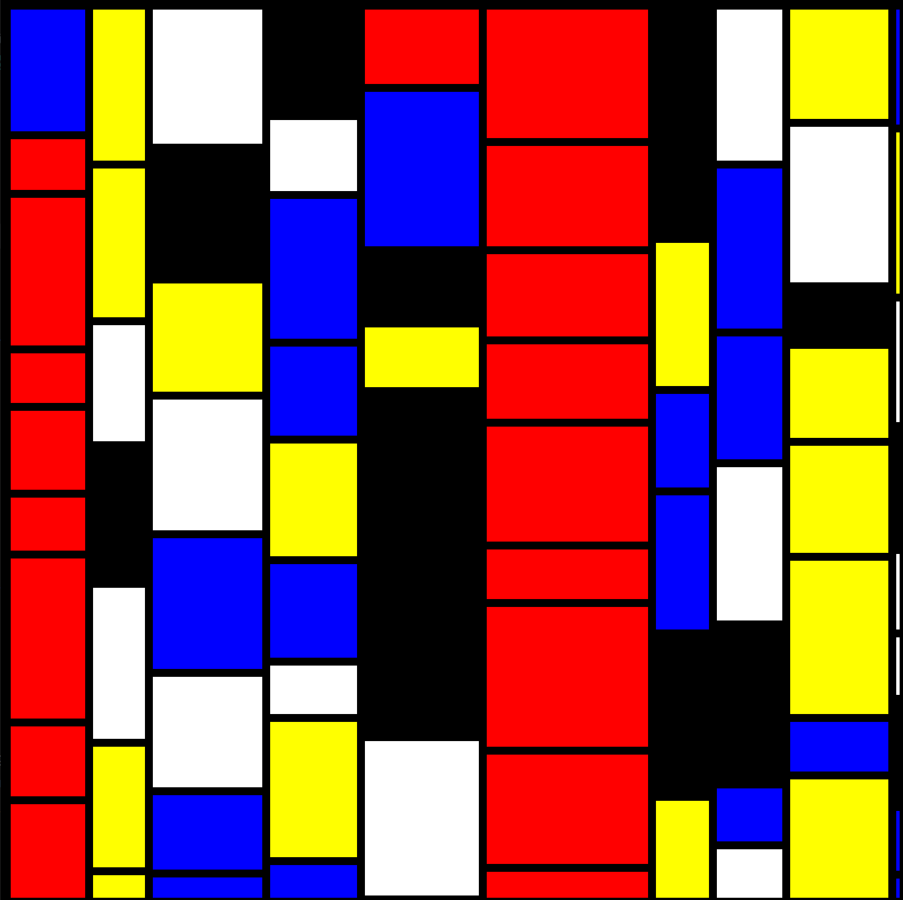
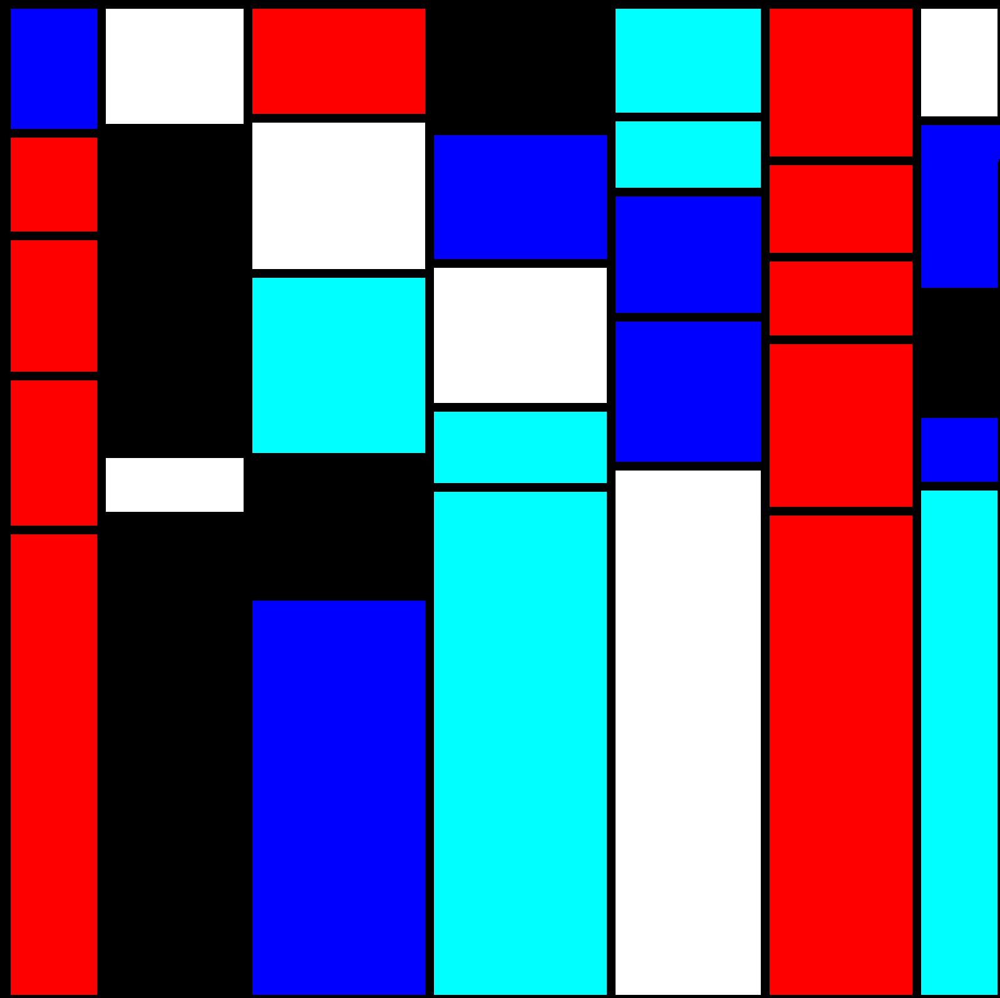
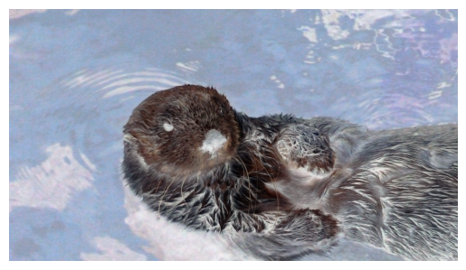
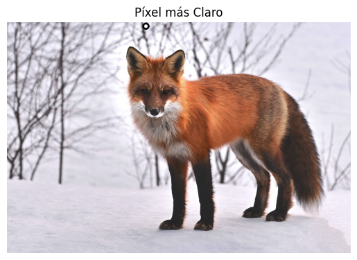
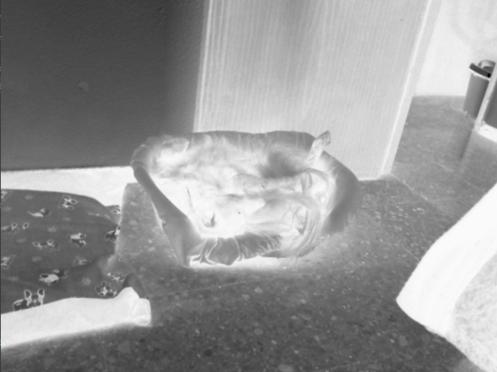
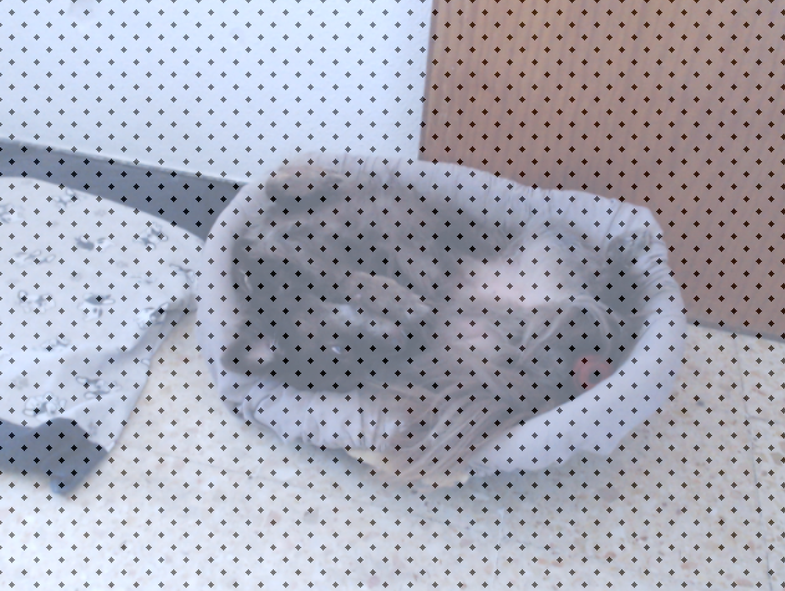

# First Assignment

This repository contains practical exercises and code related to computer vision. Each task is accompanied by a description, code implementation, and documentation.

**Please Note: This project is developed solely for a university project.**

## Table of Contents
- [First Assignment](#first-assignment)
  - [Table of Contents](#table-of-contents)
  - [Packages Used](#packages-used)
  - [Task 1: Chessboard Texture](#task-1-chessboard-texture)
  - [Task 2: Create a Mondrian-style Image](#task-2-create-a-mondrian-style-image)
  - [Task 3: Solve one of the previous tasks with OpenCV drawing functions. Chosen task: Mondrian-style Image](#task-3-solve-one-of-the-previous-tasks-with-opencv-drawing-functions-chosen-task-mondrian-style-image)
  - [Task 4: Modify Image Planes](#task-4-modify-image-planes)
  - [Task 5: Highlight Brightest and Darkest Pixels](#task-5-highlight-brightest-and-darkest-pixels)
  - [Task 6: Pop art proposal using webcam or video input](#task-6-pop-art-proposal-using-webcam-or-video-input)
    - [Invert Camera Feed Colors](#invert-camera-feed-colors)
    - [Interactive Camera Gradient](#interactive-camera-gradient)
  - [Extra Task: Dark and Light Pixel Highlighting](#extra-task-dark-and-light-pixel-highlighting)
  - [Collaborators](#collaborators)
  - [Installation Guide](#installation-guide)
    - [Setting up the Development Environment](#setting-up-the-development-environment)
    - [Basic Anaconda Commands](#basic-anaconda-commands)
  - [Disclaimer](#disclaimer)

## Packages Used
To run the code in the Jupyter notebooks, make sure you have the following packages installed:
- OpenCV (`cv2`)
- NumPy (`numpy`)
- Matplotlib (`matplotlib`)
- Random (`random`)

## Task 1: Chessboard Texture
This task involves creating an 8x8 chessboard texture and displaying it using Matplotlib.
Used documentation:
- https://www.geeksforgeeks.org/matplotlib-pyplot-tick_params-in-python/
- https://www.geeksforgeeks.org/matplotlib-pyplot-xticks-in-python/



## Task 2: Create a Mondrian-style Image
This task generates an artwork inspired by Piet Mondrian. The code randomly creates rectangles with different colors and sizes to resemble Mondrian's style.
Used documentation:
- https://docs.python.org/3/library/random.html



## Task 3: Solve one of the previous tasks with OpenCV drawing functions. Chosen task: Mondrian-style Image
This task generates an artwork inspired by Piet Mondrian. Using OpenCV drawing functions, it creates a canvas, divides it into random rectangles with varying colors, and adds a black border.
Used documentation:
- https://docs.opencv.org/4.x/dc/da5/tutorial_py_drawing_functions.html



## Task 4: Modify Image Planes
This task demonstrates how to manipulate image planes by cropping and rotating a portion of an image. It also inverts the colors of an image.
Used documentation:
- https://docs.opencv.org/3.4/d2/de8/group__core__array.html
- https://docs.opencv.org/3.4/d3/df2/tutorial_py_basic_ops.html
- https://docs.opencv.org/3.4/da/d54/group__imgproc__transform.html
- https://omes-va.com/operadores-bitwise/



## Task 5: Highlight Brightest and Darkest Pixels
Here, you will find code that identifies and highlights the brightest and darkest pixels in an image. The positions of these pixels are visualized.
Used documentation:
- https://docs.opencv.org/4.x/d6/d6e/group__imgproc__draw.html#gaf10604b069374903dbd0f0488cb43670
- https://numpy.org/doc/stable/reference/generated/numpy.argmin.html



## Task 6: Pop art proposal using webcam or video input

### Invert Camera Feed Colors
In this task, you will find code that inverts the colors of a live camera feed in real-time, creating an interesting visual effect.
Used documentation:
- https://omes-va.com/operadores-bitwise/



### Interactive Camera Gradient
This task involves an interactive camera feed where the user's mouse movement controls a gradient effect applied to the video feed. The code uses OpenCV to achieve this effect.
Used documentation:
- https://docs.opencv.org/3.4/d5/dc4/tutorial_adding_images.html



## Extra Task: Dark and Light Pixel Highlighting
This task involves capturing vieo frames from a camera feed and identifying the darkest and brightest pixels in each frame. It highlights the darkest and the brightest pixel just as done in Task 5.


## Collaborators

- [Selene](https://github.com/SeleneGonzalezCurbelo)
- [Mele13](https://github.com/mele13)

Please note that the names listed below might be nicknames.

## Installation Guide
The guide presented here are a modification of the original installation guide created by [otsedom](https://github.com/otsedom/otsedom.github.io/tree/main/VC/P1).

This section outlines the steps required to set up the development environment for the practice.

### Setting up the Development Environment
Anaconda allows you to create different environments, each with its own packages and specific versions. You can also easily switch between environments when working with Visual Studio Code. For those who prefer not to use Windows, I can confirm that my experience with Miniconda on Linux has been similar.
To run the provided notebooks on your computer after installing Anaconda and Visual Studio Code, follow these steps:
1. Launch Visual Studio Code (on the lab PC, it's available on the desktop).
2. Install the Python extension for Visual Studio Code. You can find it in the Marketplace (https://marketplace.visualstudio.com/items?itemName=ms-python.python).
3. Open Anaconda Prompt.
4. Create an environment with your desired configuration. To create an environment that can run the notebooks for this practice with a recent version of Python (e.g. 3.11.5), as in the following command:
    ```bash
    conda create --name ENV_NAME python=3.11.5
    ```
5. Activate the environment and install a couple of additional packages:
    ```bash
    conda activate ENV_NAME
    pip install opencv-python
    pip install matplotlib
    ```
Once the environment is created and activated:
1. Have both Visual Studio Code and the Anaconda Prompt running.
2. In Visual Studio Code, open the file named 'Practica1_SeleneGonzalezCurbelo_MarianaSurosAlvarez.ipynb'.
3. In Visual Studio Code, open the Command Palette using the combination Ctrl+Shift+P.
4. Select the recently created environment by typing "Python: Select Interpreter" and choosing the one created.
    * On some machines, when running the above command, you may encounter an error like "interpreter not found." You can resolve this by selecting the "Trust" mode instead of "Restricted" in the bottom left corner.
    * Make sure you have selected the correct environment on the top right corner of Visual Studio Code.

If you encounter errors, this might be because you need to install necessary elements for notebook usage by installing "ipykernel." This can be fixed by executing the following command, not from the created environment but the base environment:
```bash
conda install -n ENV_NAME ipykernel --update-deps --force-reinstall
```
Once you reach this point, you should be able to execute the notebook for this first practice. Fingers crossed, and let's explore the variations we encounter.

### Basic Anaconda Commands
During the environment creation process, you may encounter errors or need to delete and recreate an environment or list existing environments. Here's a brief summary of common commands:
- List existing environments:
    ```bash
    conda info --envs
    ```
- Remove an environment (replace "ENV_NAME" with your environment's name):
    ```bash
    conda remove --name ENV_NAME --all
    ```
- Generate a text file with the elements present in the activated environment:
    ```bash
    conda list --explicit > spec-file.txt
    ```

## Disclaimer
The files presented here are a modification of the original files created by [otsedom](https://github.com/otsedom/otsedom.github.io/tree/main/VC/P1).

These tasks are developed exclusively for educational purposes as part of a university course. 

--------------------------------------------------

Feel free to explore, learn, and have fun with these tasks! If you have any questions or suggestions, please open an issue on the repository.
