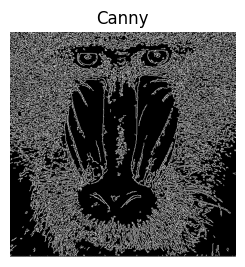
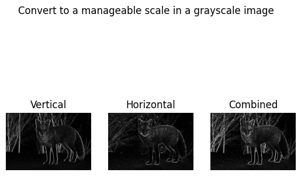
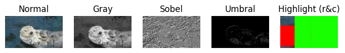

# Second Assignment

This repository contains practical exercises and code related to computer vision. Each task is accompanied by a description, code implementation, and documentation.

**Please Note: This project is developed solely for a university project.**

## Table of Contents
- [Second Assignment](#second-assignment)
  - [Table of Contents](#table-of-contents)
  - [Packages Used](#packages-used)
  - [Task 1: White Pixel Count and Maximum Detection](#task-1-white-pixel-count-and-maximum-detection)
  - [Task 2: Sobel Before and After Scale Adjustment](#task-2-sobel-before-and-after-scale-adjustment)
  - [Task 3: Threshold Sobel Image and Canny Results](#task-3-threshold-sobel-image-and-canny-results)
  - [Task 4: Select Webcam Input for Non-VC Course Audience](#task-4-select-webcam-input-for-non-vc-course-audience)
  - [Task 5: Color Highlighting in Real-time Video Stream](#task-5-color-highlighting-in-real-time-video-stream)
  - [Extra: Color Highlighting in Real-time Video Stream with Motion Function](#extra-color-highlighting-in-real-time-video-stream-with-motion-function)
  - [Collaborators](#collaborators)
  - [Disclaimer](#disclaimer)

## Packages Used
To run the code in the Jupyter notebooks, make sure you have the following packages installed:
- OpenCV (`cv2`)
- NumPy (`numpy`)
- Matplotlib (`matplotlib`)

## Task 1: White Pixel Count and Maximum Detection
This task involves analyzing the distribution of white pixels in a Canny edge-detection image. It calculates and visualizes the number of white pixels per column and per row, highlighting those that exceed a specified threshold.

## Task 2: Sobel Before and After Scale Adjustment
This task aims to visualize the vertical and horizontal edges in an image and their combination using the Sobel operator for edge detection.
Documentation used:
- https://docs.opencv.org/4.x/d7/d4d/tutorial_py_thresholding.html
- https://numpy.org/doc/stable/reference/generated/numpy.where.html

## Task 3: Threshold Sobel Image and Canny Results
This task explores edge detection, thresholding, and pixel count analysis using both the Sobel operator and Canny edge detection techniques on an input image, with a focus on identifying and visualizing prominent rows and columns in the image.
Documentation used:
- https://docs.opencv.org/4.x/dc/da5/tutorial_py_drawing_functions.html

## Task 4: Select Webcam Input for Non-VC Course Audience
This taks explains one of the functions of the program "Webcam Background Substraction" to someone who is not part of the course.

## Task 5: Color Highlighting in Real-time Video Stream
This task involves creating a program that allows users to interactively highlight objects of specific colors in a live webcam feed. Users can switch between different colors by pressing corresponding keys. When a color is selected, the program detects objects of that color in real-time using the computer's camera and highlights them in the video feed.
- https://handmap.github.io/hsv-vs-rgb/
- https://www.geeksforgeeks.org/multiple-color-detection-in-real-time-using-python-opencv/
- https://omes-va.com/operadores-bitwise/
- https://www.geeksforgeeks.org/python-opencv-cv2-puttext-method/

## Extra: Color Highlighting in Real-time Video Stream with Motion Function
This task is the same task as the above mentioned but with a slight change: adds a motion function that creates a blur when movement is detecting, simulating a phantasmagoric experience.

## Collaborators

- [Selene](https://github.com/SeleneGonzalezCurbelo)
- [Mele13](https://github.com/mele13)

Please note that the names listed below might be nicknames.

## Disclaimer
The files presented here are a modification of the original files created by [otsedom](https://github.com/otsedom/otsedom.github.io/tree/main/VC/P2).

These tasks are developed exclusively for educational purposes as part of a university course. 

--------------------------------------------------

Feel free to explore, learn, and have fun with these tasks! If you have any questions or suggestions, please open an issue on the repository.