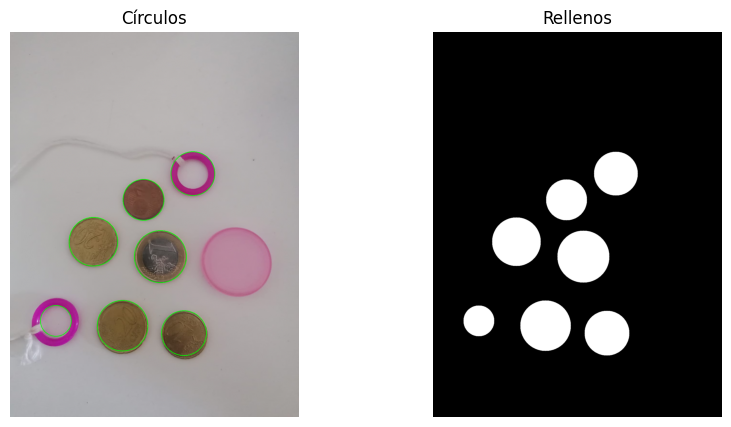
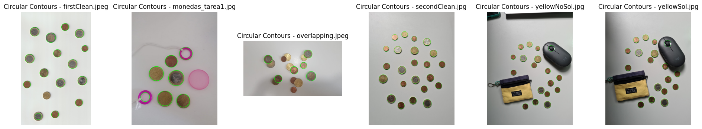
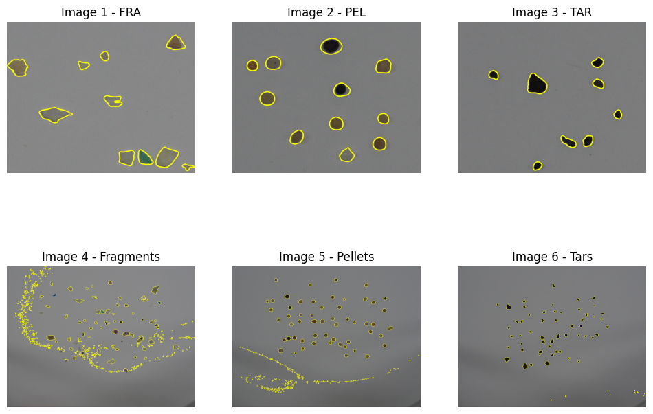

# Third Assignment

This repository contains practical exercises and code related to computer vision. Each task is accompanied by a description, code implementation, and documentation.

**Please Note: This project is developed solely for a university project.**

## Table of Contents
- [Third Assignment](#third-assignment)
  - [Table of Contents](#table-of-contents)
  - [Packages Used](#packages-used)
  - [Task 1: Coin Detection and Radius Matching in Images](#task-1-coin-detection-and-radius-matching-in-images)
  - [Task 2: Coin Detection and Value Calculation in Images](#task-2-coin-detection-and-value-calculation-in-images)
  - [Task 3: Contour-Based Classification and Analysis](#task-3-contour-based-classification-and-analysis)
  - [Collaborators](#collaborators)
  - [Disclaimer](#disclaimer)

## Packages Used
To run the code in the Jupyter notebooks, make sure you have the following packages installed:
- OpenCV (`cv2`)
- NumPy (`numpy`)
- Matplotlib (`matplotlib`)
- Tkinter (`tkinter`)
- glob (`glob`)
- math (`math`)
- os (`os`)
- numpy (`numpy`)
- threading (`threading`)

## Task 1: Coin Detection and Radius Matching in Images
This task involves capturing one or more images that contain non-overlapping coins and some objects that are not coins. The goal is to process the images to detect and draw circles with real radii corresponding to the coins. It then filters out the contours that do not correspond to coins and displays the total number of coins present in the image.
Documentation used:
- https://docs.python.org/es/3/library/tkinter.html
- https://docs.opencv.org/4.x/da/d53/tutorial_py_houghcircles.html

## Task 2: Coin Detection and Value Calculation in Images
This task involves analyzing images containing both non-overlapping and overlapping coins. The main goal is to identify coins of specific values within these images. The identification process is initiated by clicking on a coin, after which the system calculates the coin's value based on its radius. Additionally, the code provides information about the total count of coins in the image and calculates the combined monetary value of all the coins present.
- https://www.carm.es/web/pagina?IDCONTENIDO=718&IDTIPO=100&RASTRO=c285$m
- https://acodigo.blogspot.com/2017/09/deteccion-de-lineas-y-circulos-usando.html
- https://dev.to/tinazhouhui/coin-amount-calculation-discovering-opencv-with-python-52gn

## Task 3: Contour-Based Classification and Analysis
This task involves determining geometric patterns for three distinct classes of images and evaluating their classification accuracy using confusion matrices. The goal is to analyze the geometric features of images in each class and assess how well they can be distinguished from each other.
Documentation used:
- https://stackoverflow.com/questions/72118665/particle-detection-with-python-opencv
- https://learnopencv.com/blob-detection-using-opencv-python-c/

## Collaborators

- [Selene](https://github.com/SeleneGonzalezCurbelo)
- [Mele13](https://github.com/mele13)

Please note that the names listed below might be nicknames.

## Disclaimer
The files presented here are a modification of the original files created by [otsedom](https://github.com/otsedom/otsedom.github.io/tree/main/VC/P3).

These tasks are developed exclusively for educational purposes as part of a university course. 

--------------------------------------------------

Feel free to explore, learn, and have fun with these tasks! If you have any questions or suggestions, please open an issue on the repository.