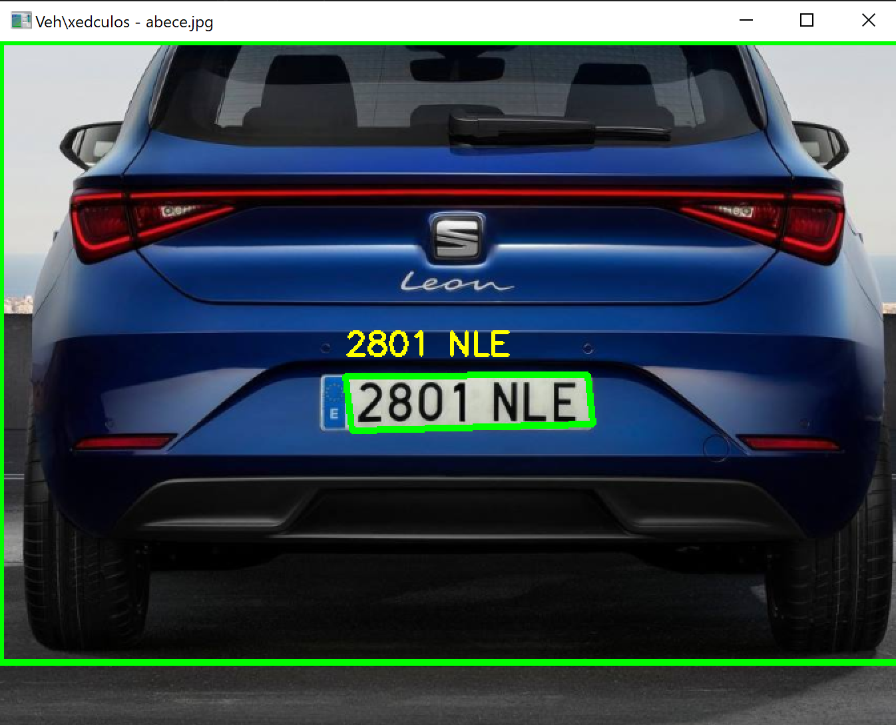
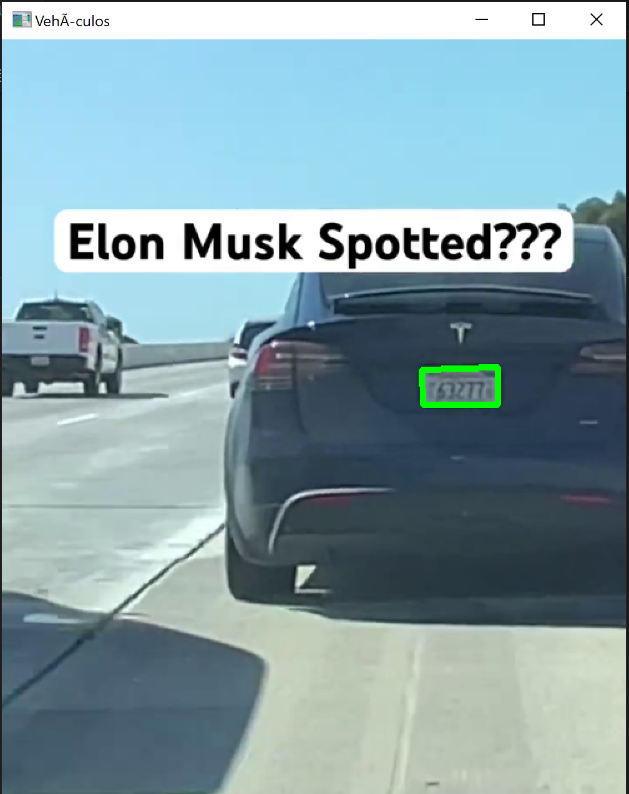
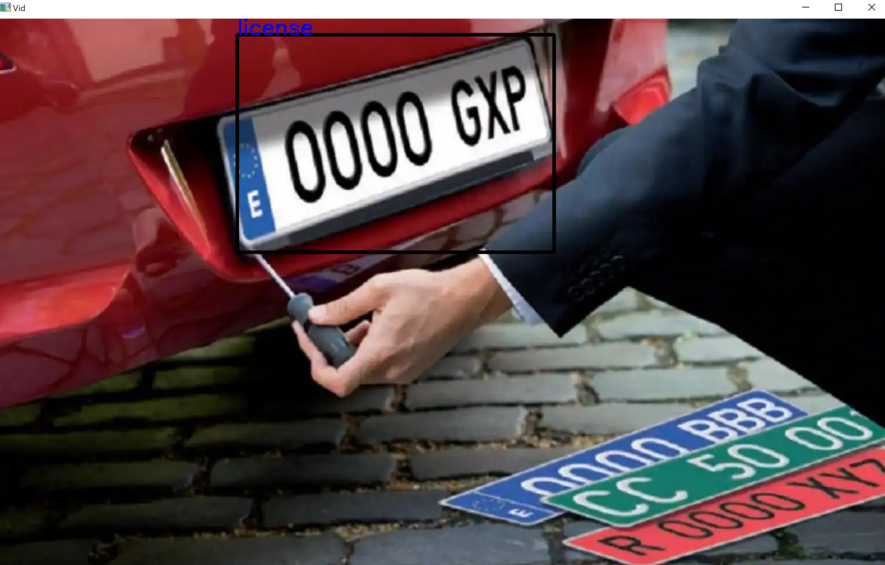

# Fith Assignment

This repository contains practical exercises and code related to computer vision. Each task is accompanied by a description, code implementation, and documentation.

**Please Note: This project is developed solely for a university project.**

## Table of Contents
- [Fith Assignment](#fith-assignment)
  - [Table of Contents](#table-of-contents)
  - [Packages Used](#packages-used)
  - [Task: Vehicle Detection and License Plate Recognition](#task-vehicle-detection-and-license-plate-recognition)
    - [Images - License Plate Recognition \& Vehicle Detection Using YOLO and tesseract](#images---license-plate-recognition--vehicle-detection-using-yolo-and-tesseract)
    - [Video - License Plate Recognition Using tesseract](#video---license-plate-recognition-using-tesseract)
    - [License Plate Recognition using YOLO](#license-plate-recognition-using-yolo)
  - [Issues](#issues)
  - [Documentation used](#documentation-used)
  - [Collaborators](#collaborators)
  - [Disclaimer](#disclaimer)

## Packages Used
To run the code in the Jupyter notebooks, make sure you have the following packages installed:
- OpenCV (`cv2`)
- math (`math`)
- os (`os`)
- imutils (`imutils`)
- re (`re`)
- NumPy (`numpy`)
- PIL (`pil`)
- ultralytics (`ultralytics`)
- pytesseract (`pytesseract`)

## Task: Vehicle Detection and License Plate Recognition
This task was developed in three subtasks: license plate recognition and vehicle detection in images, license plate recognition in videos, and license plate recognition using YOLO with a trained model (AI).

### Images - License Plate Recognition & Vehicle Detection Using YOLO and tesseract
The code includes a license plate recognition module that uses Tesseract OCR. It extracts license plate information from detected vehicles in images. Vehicle detection is performed using the YOLO (You Only Look Once) model. The code processes images and videos to identify and draw bounding boxes around vehicles.

### Video - License Plate Recognition Using tesseract
The code includes a license plate recognition module that uses Tesseract OCR. It extracts license plate information from detected vehicles in videos.

### License Plate Recognition using YOLO
The code leverages YOLO with a trained model (AI) for license plate recognition. It demonstrates the integration of YOLO for vehicle detection and subsequent extraction of license plate information.

## Issues
For license plate recognition in vehicles without using Yolov8 both pytesseract and easyocr were used, at least in our case pytesseract gave better results although not relevant either.

An attempt was made to perform color recognition, since European license plates have specific colors. However, since the photos were taken in an uncontrolled environment and the colors depend both on the amount of light and there is any color variation, such as the incident light from a light bulb modifying the resultant color.

For rotated license plates, a rotation of the license plate area was performed taking into account the angle between two points. However, positive results were not generated. In addition, since in some cases, the license plates were far away thus, making it complicated to detect, their area was enlarged in order to find a suitable solution. The result was not different from the plate rotation: no positive results were generated.

## Documentation used
- https://docs.ultralytics.com/
- https://pypi.org/project/pytesseract/
- https://app.roboflow.com/
- https://medium.com/@harunijaz/a-step-by-step-guide-to-installing-cuda-with-pytorch-in-conda-on-windows-verifying-via-console-9ba4cd5ccbef

## Collaborators
- [Selene](https://github.com/SeleneGonzalezCurbelo)
- [Mele13](https://github.com/mele13)

Please note that the names listed below might be nicknames.

## Disclaimer
The files presented here are a modification of the original files created by [otsedom](https://github.com/otsedom/otsedom.github.io/tree/main/VC/P5).

These tasks are developed exclusively for educational purposes as part of a university course. 

--------------------------------------------------

Feel free to explore, learn, and have fun with these tasks! If you have any questions or suggestions, please open an issue on the repository.
