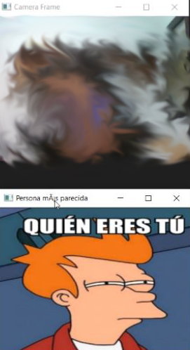

# Sixth Assignment

This repository contains practical exercises and code related to computer vision. Each task is accompanied by a description, code implementation, and documentation.

**Please Note: This project is developed solely for a university project.**

## Table of Contents
- [Sixth Assignment](#sixth-assignment)
  - [Table of Contents](#table-of-contents)
  - [Packages Used](#packages-used)
  - [Required packages](#required-packages)
  - [Task: Face Recognition and Comparison](#task-face-recognition-and-comparison)
    - [Celebrities lookalike](#celebrities-lookalike)
    - [Memes lookalike](#memes-lookalike)
  - [Collaborators](#collaborators)
  - [Disclaimer](#disclaimer)

## Packages Used
To run the code in the Jupyter notebooks, make sure you have the following packages installed:
- OpenCV (`cv2`)
- Os (`os`)
- Shutil (`shutil`)
- NumPy (`numpy`)
- DeepFace (`deepface`)
- threading (`threading`)
- time (`time`)
- queue (`queue`)

## Required packages
In order to ensure the proper functioning of the code, you need to install the following packages:

- OpenCV: a computer vision library for image and video processing.
   ```shell
   pip install opencv-python
   ```
- NumPy (numpy): a library for numerical operations in Python.
  ```shell
  pip install numpy
  ```
- DeepFace (deepface): a deep learning-based face analysis library.
  ```shell
  pip install deepface
  ```
- scikit-learn: a machine learning library for Python.
  ```shell
  pip install scikit-learn
  ```
- scikit-image: an image processing library for Python.
  ```shell
  pip install scikit-image
  ```
- Matplotlib: a 2D plotting library for Python.
  ```shell
  pip install matplotlib
  ```
- threading: a module for working with threads in Python.
  ```shell
    pip install threading
  ```
- time: a module for handling time-related tasks in Python.
  ```shell
    pip install time
  ```
- queue: a module for implementing multi-producer, multi-consumer queues in Python.
  ```shell
    pip install queue
  ```

## Task: Face Recognition and Comparison
The task suggested to extend the analysis to other deepface functionalities, such as identity verification and recognition.

### Celebrities lookalike
This project involves facial recognition and comparison using computer vision. The code captures an image from the camera, analyzes it for age, gender, and emotion, and compares it with a set of reference images to find the most similar person amongst the samples.


### Memes lookalike
This task focuses on real-time face recognition and comparison using computer vision. The code captures frames from the camera, analyzes each frame for age, gender, and emotion, and performs a similarity comparison with a set of reference images to identify the most similar person. The comparison includes features such as age, gender, and facial similarity.


Documentation used:
- https://pypi.org/project/deepface/
- https://www.youtube.com/watch?v=EdPEUkyfM8g
- Celebrities dataset: https://www.kaggle.com/datasets/vishesh1412/celebrity-face-image-dataset
- Memes dataset: https://www.reddit.com/r/MemeRestoration/comments/rfjhs0/hd_meme_templates_database_800_files/

## Collaborators
- [Selene](https://github.com/SeleneGonzalezCurbelo)
- [Mele13](https://github.com/mele13)

Please note that the names listed below might be nicknames.

## Disclaimer
The files presented here are a modification of the original files created by [otsedom](https://github.com/otsedom/otsedom.github.io/tree/main/VC/P6).

These tasks are developed exclusively for educational purposes as part of a university course. 

--------------------------------------------------

Feel free to explore, learn, and have fun with these tasks! If you have any questions or suggestions, please open an issue on the repository.
